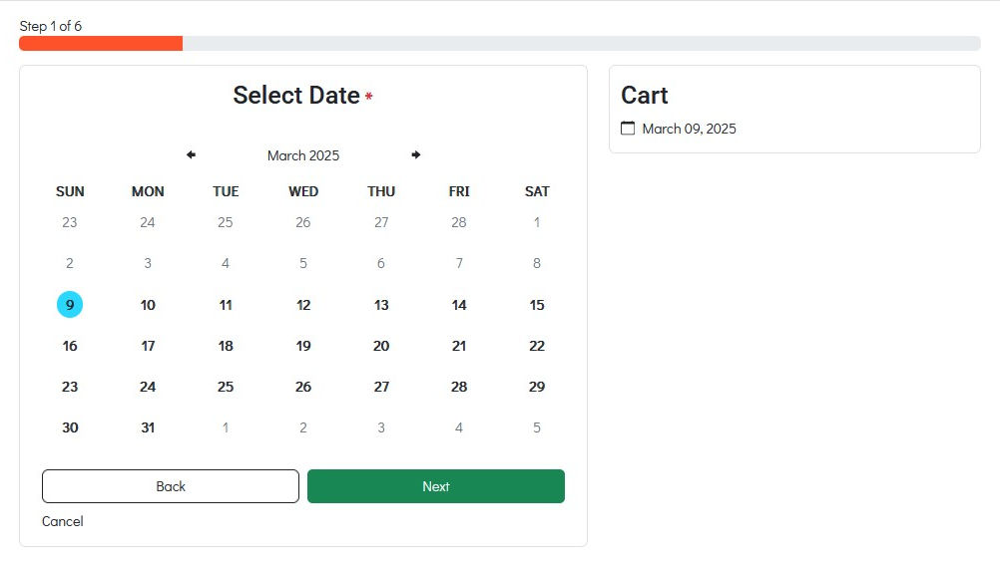
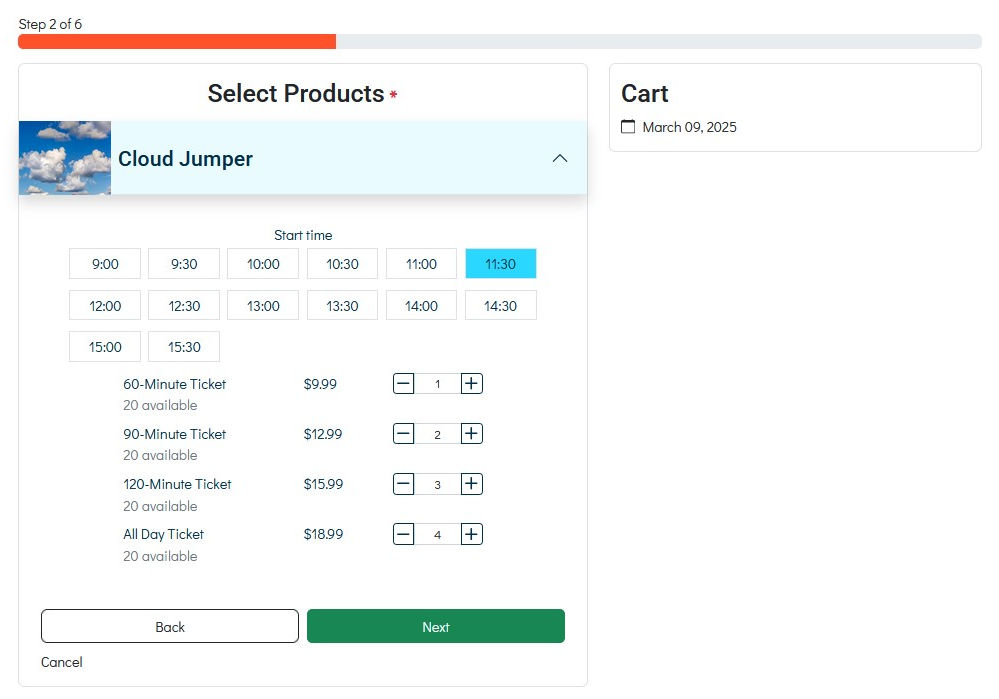
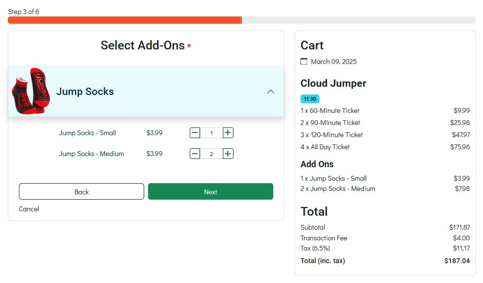
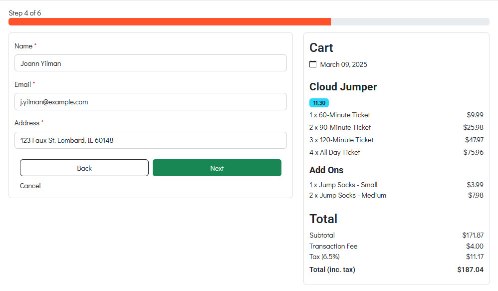
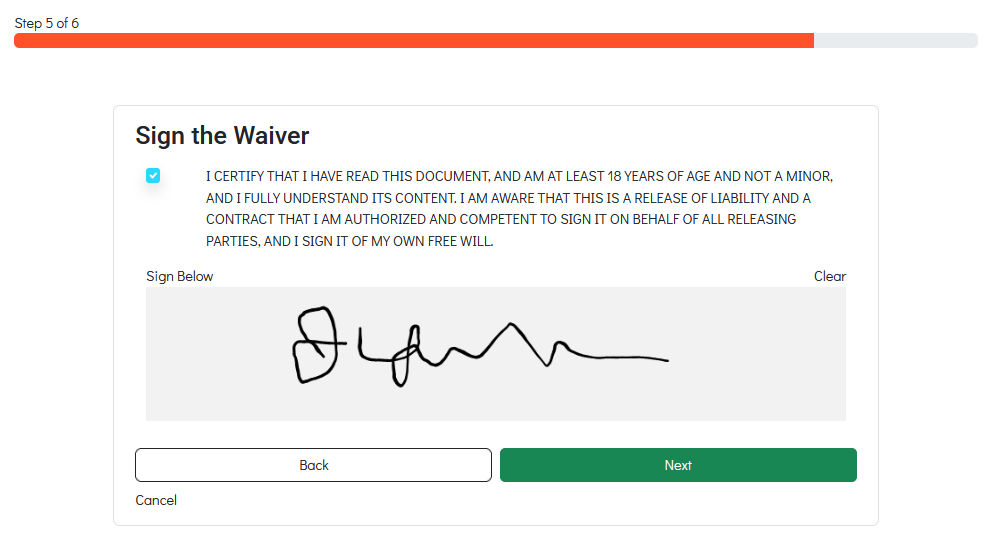
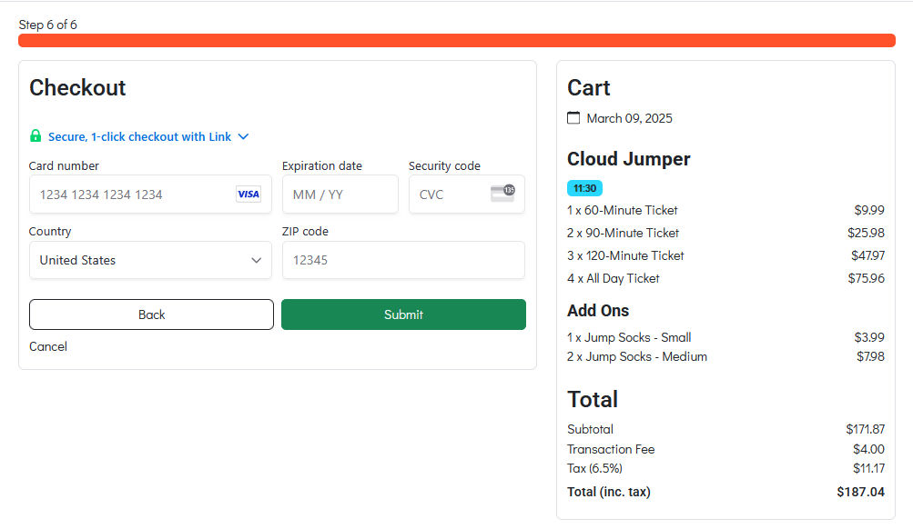
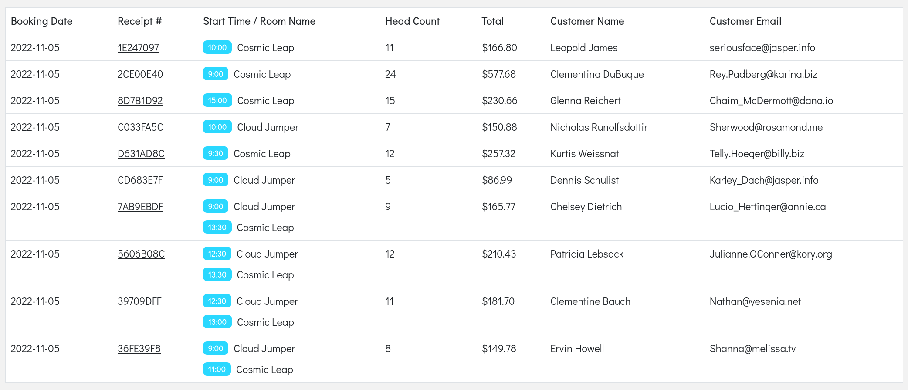
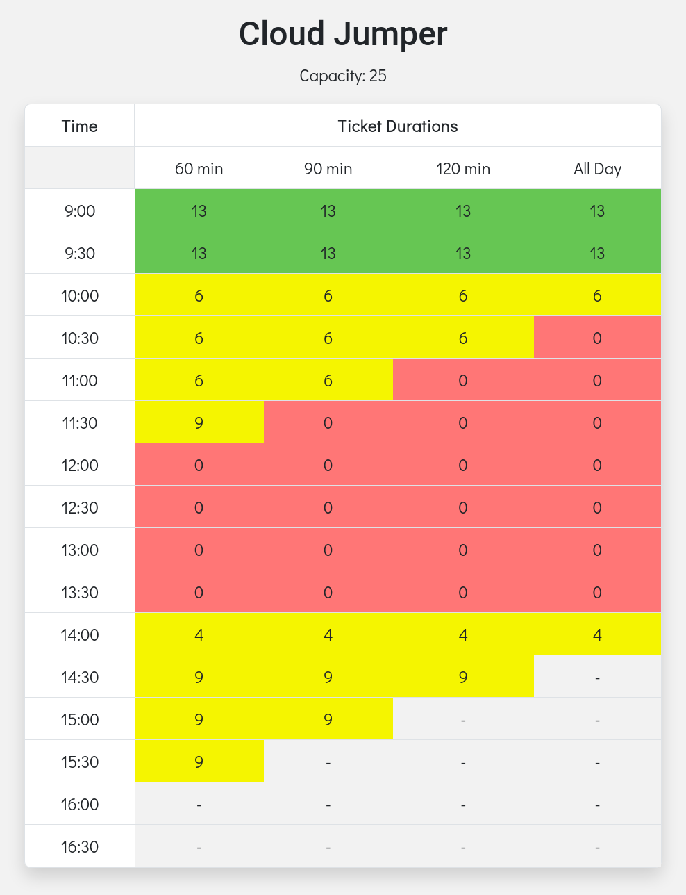
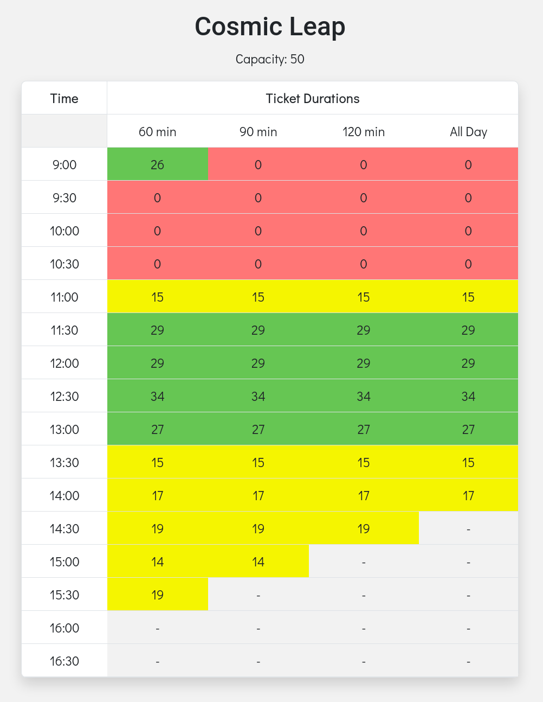

# Sky High Trampolines CMS


Live: [Sky High Tramplines](https://skyhigh-trampolines.firebaseapp.com)

This project is a CMS and appointment booking system for a fake trampoline park named **Sky High Trampolines**. It was the result of four, week-long Agile sprints enacted by four international devlopers.

- [perennialAutodidact](https://github.com/perennialAutodidact)
- [m-oniqu3](https://github.com/m-oniqu3)
- [jinchoo](https://github.com/jinchoo)
- [waldothedeveloper](https://github.com/waldothedeveloper)

This repository is a fork of [the original](https://github.com/Scott-Coates-Org/group-project-team-sapphire/) with some added features and updated styling.

<details>
<summary>Table of contents (click to expand)</summary>
<!-- vscode-markdown-toc -->
* [Tech Stack](#TechStack)
	* [Frontend](#Frontend)
	* [Backend](#Backend)
	* [CI / CD](#CICD)
* [Features](#Features)
	* [Booking UI](#BookingUI)
	* [Stripe](#Stripe)
	* [Admin UI](#AdminUI)
* [Screenshots](#Screenshots)
	* [Customer UI](#CustomerUI)
	* [Admin UI](#AdminUI-1)
* [CI / CD](#CICD-1)
	* [Staging](#Staging)
	* [Production](#Production)
* [Running Locally](#RunningLocally)
	* [Install the Firebase CLI](#InstalltheFirebaseCLI)
	* [Configuration](#Configuration)
	* [Client](#Client)
	* [Cloud Functions](#CloudFunctions)
	* [Start the Firebase Emulator](#StarttheFirebaseEmulator)
	* [Open a localtunnel Instance](#OpenalocaltunnelInstance)
	* [Listen for Stripe Events Locally](#ListenforStripeEventsLocally)
	* [Start the App Server](#StarttheAppServer)

<!-- vscode-markdown-toc-config
	numbering=false
	autoSave=true
	/vscode-markdown-toc-config -->
<!-- /vscode-markdown-toc -->
</details>

## <a name='TechStack'></a>Tech Stack

### <a name='Frontend'></a>Frontend


### <a name='Backend'></a>Backend


### <a name='CICD'></a>CI / CD


## <a name='Features'></a>Features
<a href="#sky-high-trampolines-cms">Back to top</a>

### <a name='BookingUI'></a>Booking UI
The app has a customer-facing UI for booking reservations in two different rooms. Customers can choose between multiple rooms and book dates and times for each. If a room is at maximum capacity for a particular time range, those times will be unavailable for selection by other customers.Customers must sign a waiver and the image of their signature is stored in the database with their purchase data.

### <a name='Stripe'></a>Stripe
 Purchases are sent to Stripe using Firebase serverless functions. Stripe stores a record of the purchase, generates a receipt and sends it back to Firebase using Stripe's webhooks. The receipt is then is emailed to the customer using Firebase serverless functions. 

> **Note:** When testing the purchase, use the fake data provided by Stripe.
>       The **credit card number should be `4111 1111 1111 1111`**. This indicates to Stripe that is a fake purchase for testing purposes. only
>       The rest of the billing information can receive arbitrary values.

### <a name='AdminUI'></a>Admin UI
The admin UI allows administrators to view existing bookings, quickly visual ticket availablity for each room and to view, edit, create or delete rooms, products and add-ons which will then appear in the Booking UI.

## <a name='Screenshots'></a>Screenshots
<a href="#sky-high-trampolines-cms">Back to top</a>

### <a name='CustomerUI'></a>Customer UI
<table>
    <tr>
        <th colspan="3">Booking Wizard</th>
    </tr>
    <tr>
        <td>
            
        </td>
        <td>
            
        </td><td>
            
        </td>
    </tr>
    <tr>
        <td>
            
        </td>
        <td>
            
        </td>
        <td>
            
        </td>
    </tr>
</table>

### <a name='AdminUI-1'></a>Admin UI

<table>
    <tr>
        <th>Bookings List</th>
        <th>Daily Availability (Cloud Jumper Room)</th>
        <th>Daily Availability (Cosmic Leap Room)</th>
    </tr>
    <tr>
        <td>
            
        </td>
        <td>
            
        </td>
         <td>
            
        </td>
    </tr>
</table>

## <a name='CICD-1'></a>CI / CD
<a href="#sky-high-trampolines-cms">Back to top</a>

Github Action workflows exist for both staging and production environments.

### <a name='Staging'></a>Staging
When a **branch is pushed and a pull request is created**, a build will be created and deployed to Firebase in the staging environment for inspection.

### <a name='Production'></a>Production
When a **pull request is merged** with the `main` branch, a build will be created and deployed the Firebase in the production environment.

## <a name='RunningLocally'></a>Running Locally
<a href="#sky-high-trampolines-cms">Back to top</a>

This project uses Node 16.17.0 via `nvm` and `yarn` as the package manager. 

```
$ nvm use 16.17.0 && npm i g yarn
```

### <a name='InstalltheFirebaseCLI'></a>Install the Firebase CLI
```
$ npm i g firebase-tools
```
### <a name='Configuration'></a>Configuration
The local environment will require an active Firebase project setup for configuration and authentication. This app utilizes the Stripe, SendGrid and Google Places APIs and will therefore require accounts and keys for those services. If you intend on receiving emailed receipts from the app, a SendGrid email template will have to be created that accepts values to dynamically create the email. The template's id will be included in the cloud functions' `.env.local` file.
### <a name='Client'></a>Client

Create a `.env.local` file in the project's root directory with a value for each variable.

```
# .env.local

REACT_APP_FIREBASE_AUTH_DOMAIN=<YOUR_PROJECT>.firebaseapp.com
REACT_APP_FIREBASE_API_KEY=<YOUR_API_KEY>
REACT_APP_FIREBASE_PROJECT_ID=<YOUR_PROJECT_ID>
REACT_APP_FIREBASE_STORAGE_BUCKET=<YOUR_PROJECT>.appspot.com

REACT_APP_STRIPE_PUBLISHABLE_KEY=pk_test_<YOUR_STRIPE_PUBLISHABLE_KEY>
REACT_APP_GOOGLE_PLACES_API_KEY=<YOUR_GOOGLE_PLACES_API_KEY>
```
### <a name='CloudFunctions'></a>Cloud Functions
This app uses the Google Secrets Manager in production to handle secret values, but the cloud functions are configured to use `.env.local` in developement. Create `.env.local` in the `functions` folder and add values for the following variables:

```
# functions/.env.local

SENDGRID_API_KEY=<YOUR_SENDGRID_API_KEY>
SENDGRID_TEMPLATE_ID=<YOUR_SENDGRID_TEMPLATE_ID>

STRIPE_SECRET_KEY=sk_test_<YOUR_STRIPE_SECRET_KEY>
STRIPE_HANDLE_EVENT_SECRET=whsec_<YOUR_STRIPE_CLI_WEBHOOK_SECRET>

NODE_ENV=DEVELOPMENT
```

### <a name='StarttheFirebaseEmulator'></a>Start the Firebase Emulator
```
$ firebase emulators:start --import ./emulator/data
```

### <a name='OpenalocaltunnelInstance'></a>Open a localtunnel Instance
In order to communicate with Stripe webhooks locally, a localtunnel url will be used. See [this blog post](https://dev.to/perennialautodidact/connecting-stripe-webhooks-to-firebase-cloud-functions-on-localhost-using-localtunnel-55o9) for more details. The port number is the number used by the Firebase emulator to serve the Firebase functions.

```
$ npx localtunnel --port 5001
```
Copy the generated URL.
### <a name='ListenforStripeEventsLocally'></a>Listen for Stripe Events Locally
Install the [Stripe CLI](https://stripe.com/docs/stripe-cli#install) and login. Use the localtunnel URL to forward Stripe events to the local machine.
```
$ stripe listen --forward-to https://<YOUR_LOCAL_TUNNEL_URL>.loca.lt/<YOUR_PROJECT_NAME>/us-central1/handleStripeEvent
```

### <a name='StarttheAppServer'></a>Start the App Server
```
$ yarn start
```
---

<a href="#sky-high-trampolines-cms">Back to top</a>
