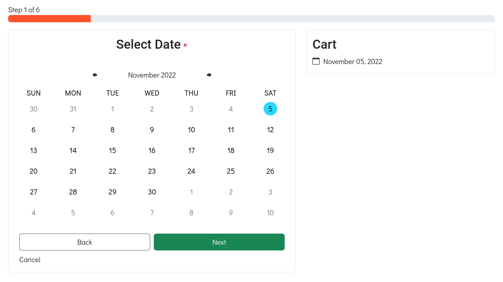
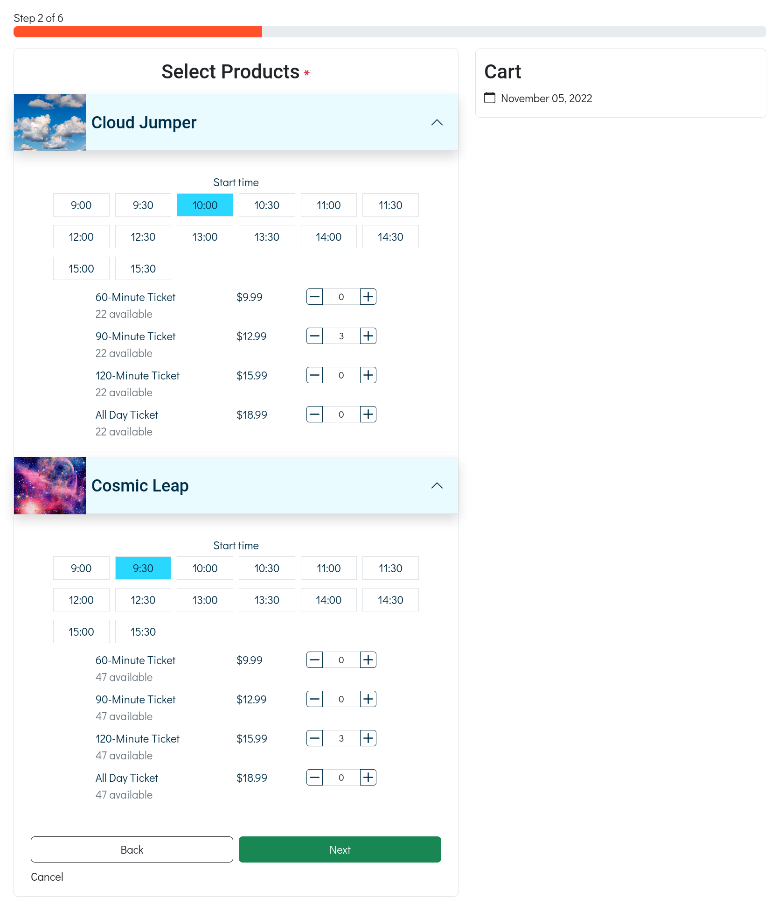
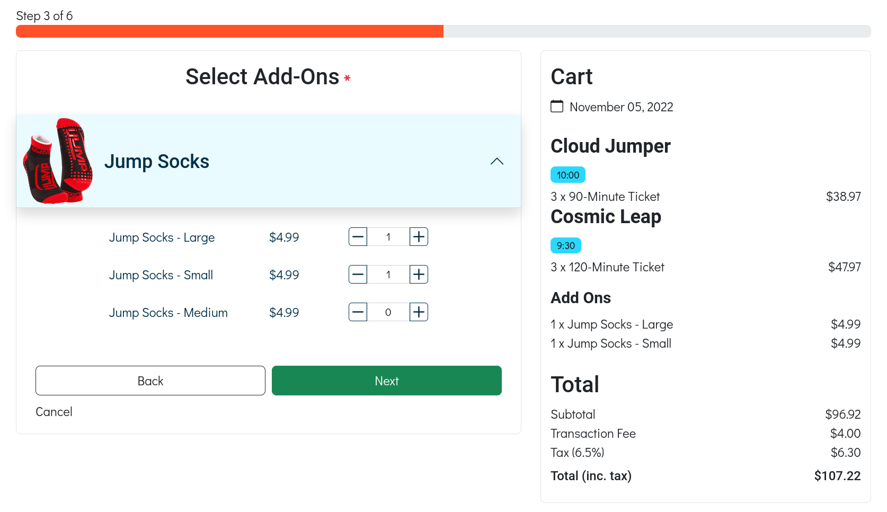
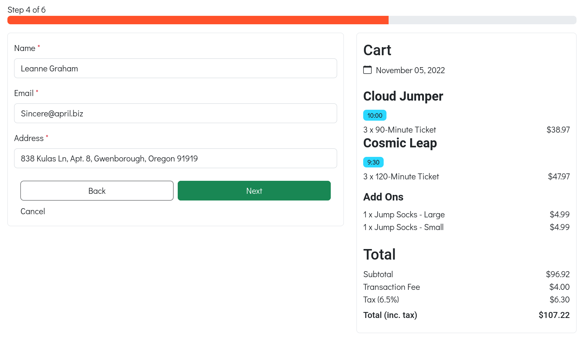
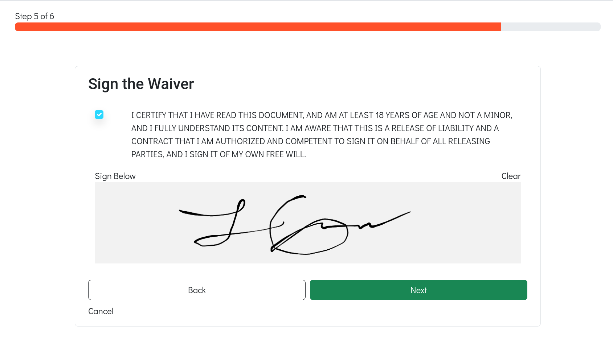
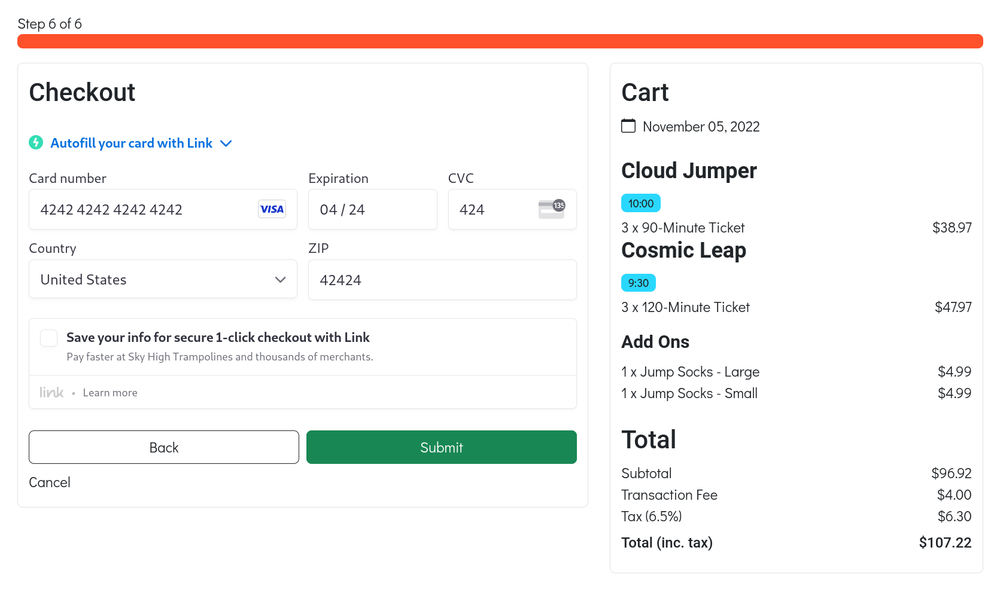

# Sky High Trampolines CMS


Live: [Sky High Tramplines](https://skyhigh-trampolines.firebaseapp.com)

This project is a CMS and appointment booking system for a fake trampoline park named **Sky High Trampolines**. It was the result of four, week-long Agile sprints enacted by four international devlopers.

- [perennialAutodidact](https://github.com/perennialAutodidact)
- [m-oniqu3](https://github.com/m-oniqu3)
- [jinchoo](https://github.com/jinchoo)
- [waldothedeveloper](https://github.com/waldothedeveloper)

This repository is a fork of [the original](https://github.com/Scott-Coates-Org/group-project-team-sapphire/) with some added features and updated styling.

## Tech Stack

### Frontend


### Backend


## Features

The app has a customer-facing UI for booking reservations in two different rooms and an admin UI for viewing existing bookings, visualizing ticket availablity for each room and viewing/creating additional rooms, products and add-ons.

## Customer UI
<table>
    <tr>
        <th colspan="3">Booking Wizard</th>
    </tr>
    <tr>
        <td>
            
        </td>
        <td>
            
        </td><td>
            
        </td>
    </tr>
    <tr>
        <td>
            
        </td>
        <td>
            
        </td>
        <td>
            
        </td>
    </tr>
</table>

## Admin UI

<table>
    <tr>
        <th>Bookings List</th>
        <th>Daily Availability</th>
    </tr>
    <tr>
        <td>
            
        </td>
        <td>
            
        </td>
    </tr>
</table>

## Running Locally

This project uses Node 16.17.0 via `nvm` and `yarn` as the package manager. 

```
$ nvm use 16.17.0 && npm i g yarn
```

### Install the Firebase CLI
```
$ npm i g firebase-tools
```
### Configuration
The local environment will require an active Firebase project setup for configuration and authentication. This app utilizes the Stripe, SendGrid and Google Places APIs and will therefore require accounts and keys for those services. If you intend on receiving emailed receipts from the app, a SendGrid email template will have to be created that accepts values to dynamically create the email. The template's id will be included in the cloud functions' `.env.local` file.
### Client

Create a `.env.local` file in the project's root directory with a value for each variable.

```
# .env.local

REACT_APP_FIREBASE_AUTH_DOMAIN=<YOUR_PROJECT>.firebaseapp.com
REACT_APP_FIREBASE_API_KEY=<YOUR_API_KEY>
REACT_APP_FIREBASE_PROJECT_ID=<YOUR_PROJECT_ID>
REACT_APP_FIREBASE_STORAGE_BUCKET=<YOUR_PROJECT>.appspot.com

REACT_APP_STRIPE_PUBLISHABLE_KEY=pk_test_<YOUR_STRIPE_PUBLISHABLE_KEY>
REACT_APP_GOOGLE_PLACES_API_KEY=<YOUR_GOOGLE_PLACES_API_KEY>
```
### Cloud Functions
This app uses the Google Secrets Manager in production to handle secret values, but the cloud functions are configured to use `.env.local` in developement. Create `.env.local` in the `functions` folder and add values for the following variables:

```
# functions/.env.local

SENDGRID_API_KEY=<YOUR_SENDGRID_API_KEY>
SENDGRID_TEMPLATE_ID=<YOUR_SENDGRID_TEMPLATE_ID>

STRIPE_SECRET_KEY=sk_test_<YOUR_STRIPE_SECRET_KEY>
STRIPE_HANDLE_EVENT_SECRET=whsec_<YOUR_STRIPE_CLI_WEBHOOK_SECRET>

NODE_ENV=DEVELOPMENT
```

### Start the Firebase Emulator
```
$ firebase emulators:start --import ./emulator/data
```

### Open a localtunnel Instance
In order to communicate with Stripe webhooks locally, a localtunnel url will be used. See [this blog post](https://dev.to/perennialautodidact/connecting-stripe-webhooks-to-firebase-cloud-functions-on-localhost-using-localtunnel-55o9) for more details. The port number is the number used by the Firebase emulator to serve the Firebase functions.

```
$ npx localtunnel --port 5001
```
Copy the generated URL.
### Listen for Stripe Events Locally
Install the [Stripe CLI](https://stripe.com/docs/stripe-cli#install) and login. Use the localtunnel URL to forward Stripe events to the local machine.
```
$ stripe listen --forward-to https://<YOUR_LOCAL_TUNNEL_URL>.loca.lt/<YOUR_PROJECT_NAME>/us-central1/handleStripeEvent
```

### Start the App Server
```
$ yarn start
```
